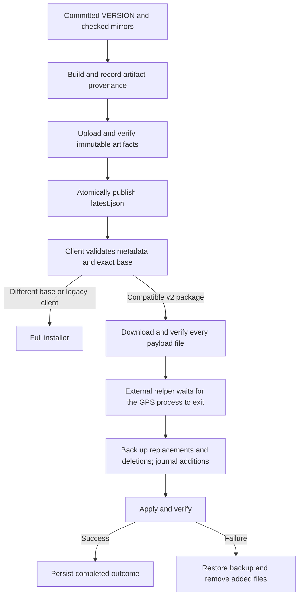

# Update reliability audit

Audit date: 2026-09-06. Baseline: `staging` at `55b3d4c`, following the user-tested capture, opacity and support-link changes.

## Version and publication baseline

The published release is **v1.0.0**. The source checkout still declared 0.7.12 in both `config.ini` and `installer/spaceDrive.iss`. The previous release script changed those files before building but tagged the existing Git commit, so the tagged source could disagree with the shipped application.

This change synchronizes the source to **1.0.0 without incrementing it**. `VERSION` becomes the application-version authority; the configuration and installer declarations are checked mirrors. Build and release commands validate the version rather than silently changing it. User preferences cannot override the running application's version.

The production endpoints were inspected read-only:

| Item | Observed result |
| --- | --- |
| [Release metadata](https://padek-interactive.tech/releases/latest.json) | HTTP 200; v1.0.0, dated 2026-06-10 |
| [Full installer](https://padek-interactive.tech/releases/SpaceDrive-Setup-v1.0.0.exe) | HTTP 200; 74,607,696 bytes |
| [Published file manifest](https://padek-interactive.tech/releases/manifests/SpaceDrive-manifest-v1.0.0.json) | HTTP 200; 3,517 entries |
| Published v0.9.5 to v1.0.0 delta | 6,058,440 bytes; SHA-256 matched `latest.json`; three payload files |
| Bundled configuration inside that delta | `app_version = v1.0.0` |
| Legacy delta metadata | No exact-base package manifest and no deleted-file list |

No production installer, metadata, release or tag was changed during this audit.

## Defects found

| Defect in the baseline | User-visible consequence | Required correction |
| --- | --- | --- |
| Version mirrors and release tags could disagree with built files | Incorrect update comparisons or an installer labelled with the wrong version | One version authority, checked mirrors, source and artifact provenance |
| Network failures returned the same empty result as an up-to-date installation | Offline users were told they had the latest version | Separate error, current and update-available states |
| The Options UI bypassed `can_apply_delta` and trusted `delta.available` | A differential package could be offered to an incompatible installation | Select only a validated package for the exact installed base version |
| Writable installations were patched inside the running GPS process | Windows could reject replacement of the executable or loaded DLLs | Apply outside the application, after its exact process has exited |
| Launching an elevated process was marked as a completed update | Cancelled or failed operations could appear successful | Persist pending, applying, completed and failed outcomes separately |
| Checksum keys used POSIX paths while Windows consumers used backslashes; missing hashes were tolerated | Nested payload files could bypass verification | Canonical paths and complete, mandatory SHA-256 coverage |
| ZIP extraction and deletion paths were accepted without a strict package contract | Unexpected files or paths could reach the installation | Validate package structure, paths, duplicate names, hashes and versions before mutation |
| Deleted files were not backed up; newly created files were not removed by rollback | A failed update could leave a mixed installation | Journal replacements, additions and deletions, then restore the full previous state |
| The producer never wrote `DELETED.txt` | Obsolete bundled files survived differential updates | Include removed files in the differential package |
| Recovery offered an unimplemented Resume button | The advertised recovery action did nothing | Provide actual recovery or the full-installer fallback |
| `latest.json` could be published directly and release selection used timestamps | Interrupted uploads or an old artifact could become the public update | Verify artifacts first and replace the public pointer atomically |
| Local release and tag-triggered CI could both publish | Duplicate or conflicting publication attempts | Keep publication local; CI tests and builds PRs for main and staging |
| Test fixtures redirected paths after constructors had already written files | Tests could modify the developer checkout | Isolate installation and user-data paths before construction |
| Startup-check and skipped-version settings were stored but never consumed | Enabling a startup check or skipping a version had no useful effect | Expose the opt-in setting, run one background startup check and honor skipped versions |

Independent review also exercised failures in metadata writes and concurrent preparation. Rollback must still restore files if status logging fails. Separate preparation and apply locks prevent competing instances from changing the transaction metadata, and an elevated helper runs from the protected installation rather than a writable staging script.

## Compatibility with existing installations

Existing v1.0.0 clients read `delta.available` directly in the Options UI. Omitting `min_version` is therefore insufficient to prevent them from using the unsafe legacy differential updater.

New publication metadata uses **`delta_v2`** for the corrected protocol and keeps legacy **`delta.available` false**. Old clients consequently use the full installer for the transition. Corrected clients use a differential only when its declared source and target exactly match the installed and advertised versions. Other installations use the full installer.

No new release is published by this work. The transition takes effect when a later, explicitly incremented release is built and published through the corrected release tooling.

## Transaction and publication requirements

The application must not report success merely because Windows accepted a launch request. Windows process-launch and elevation behavior is documented in [Microsoft's ShellExecute guidance](https://learn.microsoft.com/en-us/windows/win32/shell/launch). The full-installer path uses Inno Setup's normal installation flow; its treatment of applications holding files is documented under [CloseApplications](https://jrsoftware.org/ishelp/topic_setup_closeapplications.htm).

All updater logs belong under the user-data `logs/` directory. Transaction plans, backups and outcome metadata belong under `updates/`, separately from the installation and personal POI/configuration data.

The helper confirms completion before the user restarts the GPS manually. It never restarts the game overlay with administrator privileges. Automatic update checks remain disabled by default and never automatically download or install anything.

## Validation

`python -m pytest tests -q`: **327 passed** on Windows (Python 3.12), including six tests that execute the native PowerShell helper. `python tools/versioning.py check` and `git diff --check` pass. The changed PowerShell sources are ASCII-safe. A read-only check through the new client against the real production endpoint correctly reports local v1.0.0 and published v1.0.0 as current.

Validation uses an isolated feature worktree and disposable installations. The four modes of `python tools/test_update.py --mode all` pass: direct application, archive corruption after verification, automatic rollback after replacements/additions/deletions, and native Windows application followed by rollback. The integration harness uses the real publishing ZIP generator and client discovery/download code with simulated HTTP responses.

Native PowerShell tests additionally verify waiting for the exact parent process, refusing altered staging data, blocking concurrent recovery, and restoring the entire installation after a Windows file lock prevents deletion. Preparation-lock tests cover competing application instances. Network, malformed-manifest, invalid-path, missing-version, user-data preservation, UI worker shutdown, release provenance and interrupted publication cases are included in the pytest suite.

Qt renders cover available deltas, network errors, full-installer fallback, missing version markers and prepared updates, with no clipping at 680 by 668 pixels. No real installed GPS, user configuration or POI file is modified by these checks.

The real UAC consent flow and an upgrade of a complete installed production bundle remain manual validation steps. Tests simulate executable/library contents while exercising the native file operations and Windows locks. If a machine loses power and cannot launch the application at all, use the full installer; in-app recovery requires a launchable application. CI compiles the complete Windows installer for the PR without publishing it.

## Full installer integrity and validation

The installer integrity correction from [PR #81](https://github.com/Bigeldoth/sc-gps-47/pull/81), commit `949808d6eb28865e34bbd60f04f77810d297d3b0`, is integrated selectively: only `installer/spaceDrive.iss` and `tools/get_tesseract_hash.ps1` are imported. The replacement release pipeline is preserved, and the application version remains **1.0.0**. Other changes or ancestors of that PR are outside this integration.

The installer now checks the pinned Tesseract SHA-256 during download and immediately before executing the downloaded file. An unreadable file or mismatching hash fails the check. The hash-refresh tool only downloads and hashes the dependency; it does not execute or install it.

On 2026-09-06, the [official UB-Mannheim v5.4.0.20240606 release asset](https://github.com/UB-Mannheim/tesseract/releases/download/v5.4.0.20240606/tesseract-ocr-w64-setup-5.4.0.20240606.exe) returned HTTP 200 and 50,175,248 bytes. Streaming SHA-256 verification matched the pinned value `c885fff6998e0608ba4bb8ab51436e1c6775c2bafc2559a19b423e18678b60c9`; the downloaded executable was never run.

Inno Setup 6.7.1 compiled the imported script successfully using a copied `.iss`, a tiny dummy bundle and copied assets in a dedicated temporary directory. The resulting temporary installer was not executed, and the repository's build output was neither read nor replaced. This checks script compilation, not a full PyInstaller build or a real installation.

Silent prerequisite installation remains an unexecuted integration scenario in this audit. It is not correct to infer that `NextButtonClick` is skipped in silent mode: [Inno Setup's event documentation](https://jrsoftware.org/ishelp/topic_scriptevents.htm) explicitly describes simulated clicks in silent installations. The existing dependency flow still detects Tesseract only at its two conventional installation paths and logs the dependency installer's exit code without checking successful installation afterward; this integrity-only integration does not change those behaviors.
